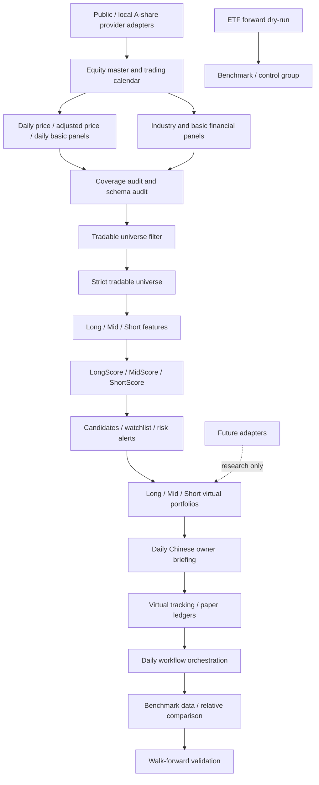

# v0.7 Architecture

Positioning: A-share full-market AI multi-horizon stock selection and virtual portfolio tracking system

## Data Flow
- Public/local provider adapters
- A-share universe and trading calendar
- daily price, adjusted price, daily basic, industry, and basic financial data panels
- historical price, adjusted price, daily basic, and financial panels
- coverage audit and schema audit
- historical coverage audit and feature readiness audit
- tradable universe filter with strict/caution/excluded/unknown buckets
- long/mid/short feature sets
- LongScore/MidScore/ShortScore/RiskScore/LiquidityScore/IndustryScore
- candidate pools and watchlists
- long/mid/short virtual portfolios
- daily Chinese owner briefing
- virtual portfolio tracking and paper ledgers
- daily workflow orchestration
- benchmark data and performance comparison
- multi-day virtual portfolio performance tracking
- walk-forward validation

## Modules
- `src/trading_core/external_intake/`
- `src/trading_core/integrations/public_data/`
- `src/trading_core/equity_universe/`
- `src/trading_core/equity_data/`
- `src/trading_core/equity_industry/`
- `src/trading_core/equity_fundamental/`
- `src/trading_core/equity_data_quality/`
- `src/trading_core/equity_features/`
- `src/trading_core/equity_scoring/`
- `src/trading_core/equity_selection/`
- `src/trading_core/equity_portfolios/`
- `src/trading_core/equity_briefings/`
- `src/trading_core/equity_portfolio_tracking/`
- `src/trading_core/equity_workflows/`
- `src/trading_core/equity_benchmarks/`
- `src/trading_core/equity_validation/`
- `src/trading_core/integrations/`

## Mermaid

## v0.7.1 Data Foundation

v0.7.1 implements the first data-only layer. It writes local artifacts for:

- A-share equity master and SSE/SZSE/BSE calendar.
- daily price, adjusted price, daily basic, industry, and basic financial panels.
- data source manifest, coverage audit, and schema audit.

The current public provider path is a qstock-style public HTTP adapter. It does not import third-party project code. When a public endpoint is delayed, partial, or unavailable, the provider result must be recorded in the manifest and the coverage audit must fail closed if the key master/calendar/daily-price foundation is insufficient.

v0.7.1 does not generate recommendations, scores, candidates, virtual portfolios, or trade instructions. Later filters, features, scores, and portfolios must consume the audited local data artifacts rather than calling provider APIs directly.

## v0.7.1.1 Historical Panel Backfill

v0.7.1.1 fills historical panels required by later filters and features. It remains data-only and readiness-audit-only. If minimum historical coverage is not met, the workflow must fail closed and no success release tag should be created.

## v0.7.1.2 Historical Data Provider Expansion

v0.7.1.2 resolves the v0.7.1.1 coverage blocker by diagnosing the 10-symbol sample result, building a full-market A-share queue from `equity_master.parquet`, adding provider fallback adapters, checkpoint/resume, batch manifests, per-symbol manifests, and global coverage ratios. It prepares the audited local data foundation for v0.7.2 tradable-universe filtering.

It still does not generate scores, candidates, watchlists, virtual portfolios, orders, broker connections, `run-daily` output, or official forward dry-run day2 artifacts.

## v0.7.2 Tradable Universe Filter

v0.7.2 consumes the audited local A-share master, trading calendar, historical price panels, daily basic data, industry classification, financial history, symbol manifest, and readiness audits. It writes daily filter artifacts under `data/equity_selection/daily/YYYY-MM-DD/` and reports under `outputs/equity_selection/daily/YYYY-MM-DD/`.

The output buckets are `strict_tradable_universe`, `caution_universe`, `excluded_universe`, and `unknown_status_universe`. Future v0.7.3 feature engineering defaults to `strict_tradable_universe`; caution names are observation-only unless a future command explicitly allows them.

v0.7.2 does not generate scores, candidates, watchlists, virtual portfolios, orders, broker connections, `run-daily` output, or official forward dry-run day2 artifacts.

## v0.7.3 Multi-Horizon Feature Engineering

v0.7.3 consumes the `strict_tradable_universe` output from v0.7.2 and audited historical panels from v0.7.1.2. It writes feature tables under `data/equity_features/daily/YYYY-MM-DD/`, reports under `outputs/equity_features/daily/YYYY-MM-DD/`, and a release audit under `data/equity_data_quality/` and `outputs/audit/`.

The feature groups are short horizon, mid horizon, long horizon, risk, liquidity, industry, and fundamental. These are atomic inputs for a future scoring stage. The stage does not generate LongScore, MidScore, ShortScore, RiskScore, LiquidityScore, candidates, watchlists, virtual portfolios, orders, broker connections, `run-daily` output, profit claims, live readiness, or official forward dry-run day2 artifacts.

## v0.7.4 Long/Mid/Short Scoring System

v0.7.4 consumes v0.7.3 strict-universe feature artifacts and writes score artifacts under `data/equity_scores/daily/YYYY-MM-DD/`, reports under `outputs/equity_scores/daily/YYYY-MM-DD/`, and a scoring audit under `data/equity_data_quality/` and `outputs/audit/`.

The score set is `LongScore`, `MidScore`, `ShortScore`, `RiskScore`, `LiquidityScore`, `IndustryScore`, `FundamentalScore`, and `CompositeOpportunityScore`. Scores, percentiles, and ranks are relative research metrics only. They are not recommendations, buy/sell signals, candidate pools, watchlists, portfolio allocations, broker instructions, real orders, profit guarantees, live readiness, or official forward dry-run day2 artifacts.

v0.7.5 consumes these scores for candidate generation. v0.7.6 consumes candidates for research-only virtual portfolios.

## v0.7.5 Candidate Generation System

v0.7.5 consumes v0.7.4 score artifacts and writes candidate artifacts under `data/equity_selection/daily/YYYY-MM-DD/`, reports under `outputs/equity_selection/daily/YYYY-MM-DD/`, and a candidate generation audit under `data/equity_data_quality/` and `outputs/audit/`.

The candidate set includes long candidates, mid candidates, short candidates, an extended watch pool, multi-horizon candidates, risk-downgraded candidates, reason breakdown, generation summary, and manifest. Selection uses ranks and percentiles with risk, liquidity, confidence, and overheat gates. The output is a research candidate package only.

Candidates are not investment advice, not buy/sell signals, not order instructions, not virtual portfolios, not broker instructions, not real orders, not profit guarantees, not live readiness, and not official forward dry-run day2 artifacts.

v0.7.6 consumes these candidates for virtual portfolio construction. v0.7.7 consumes candidates, scores, and virtual portfolios for the daily Chinese research briefing.

## v0.7.6 Virtual Portfolio Construction

v0.7.6 consumes v0.7.5 candidate artifacts and writes virtual portfolio artifacts under `data/equity_portfolios/daily/YYYY-MM-DD/`, reports under `outputs/equity_portfolios/daily/YYYY-MM-DD/`, and a virtual portfolio construction audit under `data/equity_data_quality/` and `outputs/audit/`.

The portfolio set includes `long_virtual_portfolio`, `mid_virtual_portfolio`, `short_virtual_portfolio`, portfolio target weights, industry exposure, risk/liquidity summary, manifest, reports, and audit. The portfolios are long-only, unlevered, derivatives-free, and research-only.

Virtual portfolios are not real portfolios. Virtual target weights are not buy/sell signals, not broker order previews, not real-account rebalance instructions, not broker instructions, not real orders, not profit guarantees, not live readiness, and not official forward dry-run day2 artifacts.

Daily AI stock selection briefing is handled by v0.7.7.

## v0.7.7 Daily Stock Selection Briefing

v0.7.7 consumes existing v0.7.3 feature, v0.7.4 score, v0.7.5 candidate, and v0.7.6 virtual portfolio artifacts. It writes briefing artifacts under `data/equity_briefings/daily/YYYY-MM-DD/`, reports under `outputs/equity_briefings/daily/YYYY-MM-DD/`, and a briefing audit under `data/equity_data_quality/` and `outputs/audit/`.

The briefing includes executive summary, data coverage, long/mid/short candidate Top 10 tables, multi-horizon candidates, risk-downgraded candidates, long/mid/short virtual portfolio summaries, industry exposure, risk/liquidity notes, audit status, do-not-misread notes, next tracking actions, and disclaimers.

The briefing is information-only. It does not regenerate scores, candidates, virtual portfolios, buy/sell signals, order previews, broker instructions, real orders, profit guarantees, live readiness, `run-daily`, or official forward dry-run day2 artifacts.

## v0.7.8 Virtual Portfolio Tracking And Paper Ledger

v0.7.8 consumes existing v0.7.6 virtual portfolios, v0.7.7 briefing manifests, v0.7.4 score snapshots, historical price panels, and the trading calendar. It writes tracking artifacts under `data/equity_portfolio_tracking/daily/YYYY-MM-DD/`, reports under `outputs/equity_portfolio_tracking/daily/YYYY-MM-DD/`, and a tracking audit under `data/equity_data_quality/` and `outputs/audit/`.

The tracking set includes `tracking_config`, long/mid/short paper ledgers, long/mid/short holdings snapshots, NAV, performance, drawdown, exposure, benchmark comparison, source trace, manifest, summary, and reports. First-day initialization uses adjusted close when available and close as fallback.

Paper ledgers are virtual-only and research-only. They are not real-money ledgers. Virtual holdings are not real holdings. Virtual returns are not actual returns. The stage does not regenerate scores, candidates, or portfolios, does not generate buy/sell signals or order previews, does not connect a broker, does not place real orders, does not call `run-daily`, and does not claim profit or live-trading readiness.

## v0.7.9 Daily Workflow Orchestration

v0.7.9 consumes the audited v0.7.2-v0.7.8 A-share research chain and writes orchestration artifacts under `data/equity_workflows/daily/YYYY-MM-DD/`, reports under `outputs/equity_workflows/daily/YYYY-MM-DD/`, and workflow audit output under `data/equity_data_quality/` and `outputs/audit/`.

The orchestration set includes workflow config, preflight, stage manifest, run manifest, source trace, boundary check, summary, owner-facing report, stage report, source trace report, and audit. It supports `validate_existing_artifacts`, `build_from_existing_data`, and `full_research_run`. Public data refresh is disabled by default and only allowed when explicitly enabled.

v0.7.9 is an orchestration layer only. It does not rewrite upstream business modules, does not call old `run-daily`, does not execute official forward dry-run day2, does not connect a broker, does not place real orders, does not generate buy/sell signals, does not generate order previews, does not claim model profitability, and does not certify live trading readiness.

## v0.7.10 Benchmark Data And Performance Comparison

v0.7.10 consumes v0.7.9 workflow artifacts, v0.7.8 tracking artifacts, v0.7.2-v0.7.6 selection/candidate/portfolio artifacts, local price panels, and index benchmark history. It writes benchmark artifacts under `data/equity_benchmarks/daily/YYYY-MM-DD/`, reports under `outputs/equity_benchmarks/daily/YYYY-MM-DD/`, and benchmark audit output under `data/equity_data_quality/` and `outputs/audit/`.

The benchmark set is CSI300, CSI500, CSI1000, CASH, equal-weight strict tradable universe, and equal-weight candidate pool. Index benchmarks must be available by default; placeholder index benchmarks are fail-closed unless explicitly allowed for non-release local runs.

v0.7.10 is a benchmark comparison layer only. It does not create buy/sell signals, does not generate order previews, does not connect a broker, does not place real orders, does not call old `run-daily`, does not execute official forward dry-run day2, does not claim model profitability, and does not certify live trading readiness. First-day portfolio history remains explicitly limited until v0.7.11 extends multi-day tracking.

## Boundary
- No real trading.
- No broker connection.
- No real orders.
- No third-party trading code merged into the main flow.
- No LLM direct trading decision.
- No model profit guarantee.
- ETF forward dry-run status unchanged.
- `run-daily` not called.
- Data foundation only until coverage and schema audits pass.
- v0.7.2 filter buckets are not recommendations and are not candidate lists.
- v0.7.3 feature tables are not scores, recommendations, candidate lists, watchlists, portfolios, or order plans.
- v0.7.4 score tables are not recommendations, candidate lists, watchlists, portfolios, buy/sell signals, or order plans.
- v0.7.5 candidate pools are not recommendations, buy/sell signals, portfolio allocations, order plans, broker instructions, or profit guarantees.
- v0.7.6 virtual portfolios are not real portfolios, buy/sell signals, order previews, broker instructions, real orders, or profit guarantees.
- v0.7.7 briefings are not trading advice, score regeneration, candidate regeneration, portfolio regeneration, buy/sell signals, order previews, broker instructions, real orders, or profit guarantees.
- v0.7.8 paper ledgers are not real-money ledgers; virtual holdings and virtual returns are research-only and not real account state.
- v0.7.9 workflow artifacts are orchestration-only and remain outside real trading, broker, order, and live-readiness surfaces.
- v0.7.10 benchmark artifacts are comparison-only and remain outside real trading, broker, order, and live-readiness surfaces.
- Public data may be delayed or partial; limitations are evidence, not recommendations.

## v0.7.11 Multi-Day Performance Layer

`data/equity_performance/daily/YYYY-MM-DD/` is the v0.7.11 layer after benchmark comparison. It reads existing v0.7.8 tracking, v0.7.9 workflow, v0.7.10 benchmark, and local price-panel artifacts, then writes virtual-only performance series and audit evidence.

Default mode is `current_snapshot`. `append_from_existing_tracking` appends without rewriting prior dates, and `rebuild_virtual_performance_series` requires explicit rebuild authorization. Historical reconstruction must be labeled separately and cannot be described as realized forward performance.

The layer does not create buy/sell signals, place orders, connect a broker, call old `run-daily`, execute official forward dry-run day2, or fabricate portfolio history. v0.7.12 should explain performance changes through attribution and risk diagnostics.
