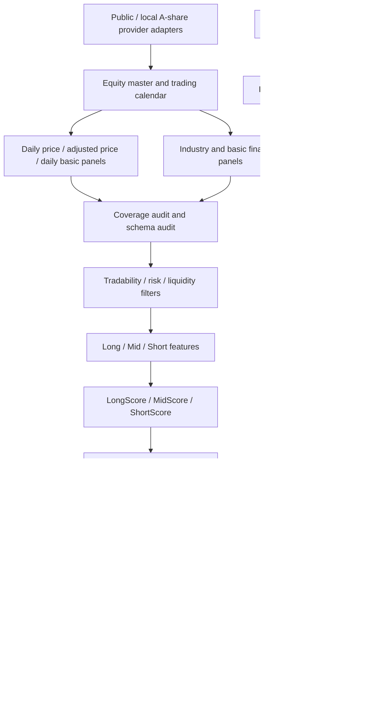

# v0.7 Architecture

Positioning: A-share full-market AI multi-horizon stock selection and virtual portfolio tracking system

## Data Flow
- Public/local provider adapters
- A-share universe and trading calendar
- daily price, adjusted price, daily basic, industry, and basic financial data panels
- historical price, adjusted price, daily basic, and financial panels
- coverage audit and schema audit
- historical coverage audit and feature readiness audit
- tradability/liquidity/risk filters
- long/mid/short feature sets
- LongScore/MidScore/ShortScore/RiskScore/LiquidityScore/IndustryScore
- candidate pools and watchlists
- long/mid/short virtual portfolios
- daily Chinese owner briefing
- walk-forward validation

## Modules
- `src/trading_core/external_intake/`
- `src/trading_core/integrations/public_data/`
- `src/trading_core/equity_universe/`
- `src/trading_core/equity_data/`
- `src/trading_core/equity_industry/`
- `src/trading_core/equity_fundamental/`
- `src/trading_core/equity_data_quality/`
- `src/trading_core/equity_features/`
- `src/trading_core/equity_scoring/`
- `src/trading_core/equity_selection/`
- `src/trading_core/equity_portfolios/`
- `src/trading_core/equity_briefing/`
- `src/trading_core/equity_validation/`
- `src/trading_core/integrations/`

## Mermaid

## v0.7.1 Data Foundation

v0.7.1 implements the first data-only layer. It writes local artifacts for:

- A-share equity master and SSE/SZSE/BSE calendar.
- daily price, adjusted price, daily basic, industry, and basic financial panels.
- data source manifest, coverage audit, and schema audit.

The current public provider path is a qstock-style public HTTP adapter. It does not import third-party project code. When a public endpoint is delayed, partial, or unavailable, the provider result must be recorded in the manifest and the coverage audit must fail closed if the key master/calendar/daily-price foundation is insufficient.

v0.7.1 does not generate recommendations, scores, candidates, virtual portfolios, or trade instructions. Later filters, features, scores, and portfolios must consume the audited local data artifacts rather than calling provider APIs directly.

## v0.7.1.1 Historical Panel Backfill

v0.7.1.1 fills historical panels required by later filters and features. It remains data-only and readiness-audit-only. If minimum historical coverage is not met, the workflow must fail closed and no success release tag should be created.

## v0.7.1.2 Historical Data Provider Expansion

v0.7.1.2 resolves the v0.7.1.1 coverage blocker by diagnosing the 10-symbol sample result, building a full-market A-share queue from `equity_master.parquet`, adding provider fallback adapters, checkpoint/resume, batch manifests, per-symbol manifests, and global coverage ratios. It prepares the audited local data foundation for v0.7.2 tradable-universe filtering.

It still does not generate scores, candidates, watchlists, virtual portfolios, orders, broker connections, `run-daily` output, or official forward dry-run day2 artifacts.

## Boundary
- No real trading.
- No broker connection.
- No real orders.
- No third-party trading code merged into the main flow.
- No LLM direct trading decision.
- No model profit guarantee.
- ETF forward dry-run status unchanged.
- `run-daily` not called.
- Data foundation only until coverage and schema audits pass.
- Public data may be delayed or partial; limitations are evidence, not recommendations.
