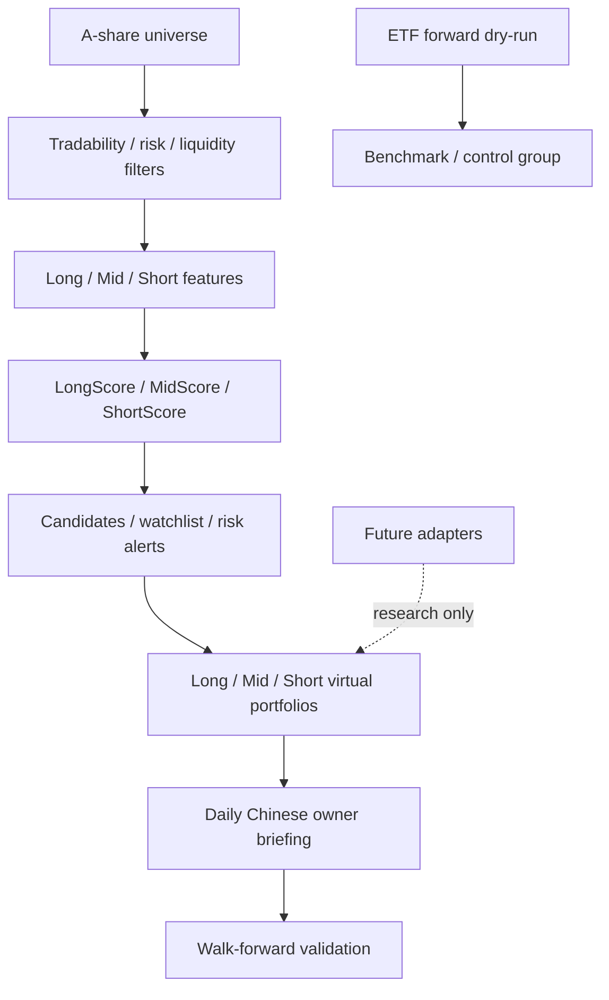

# v0.7 Architecture

Positioning: A-share full-market AI multi-horizon stock selection and virtual portfolio tracking system

## Data Flow
- A-share universe
- tradability/liquidity/risk filters
- long/mid/short feature sets
- LongScore/MidScore/ShortScore/RiskScore/LiquidityScore/IndustryScore
- candidate pools and watchlists
- long/mid/short virtual portfolios
- daily Chinese owner briefing
- walk-forward validation

## Modules
- `src/trading_core/external_intake/`
- `src/trading_core/equity_universe/`
- `src/trading_core/equity_data/`
- `src/trading_core/equity_features/`
- `src/trading_core/equity_scoring/`
- `src/trading_core/equity_selection/`
- `src/trading_core/equity_portfolios/`
- `src/trading_core/equity_briefing/`
- `src/trading_core/equity_validation/`
- `src/trading_core/integrations/`

## Mermaid

## Boundary
- No real trading.
- No broker connection.
- No real orders.
- No third-party trading code merged into the main flow.
- No LLM direct trading decision.
- No model profit guarantee.
- ETF forward dry-run status unchanged.
- `run-daily` not called.
